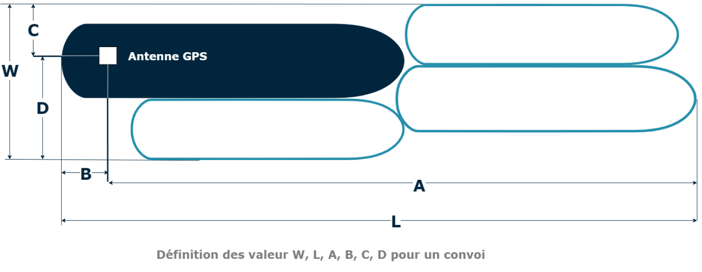
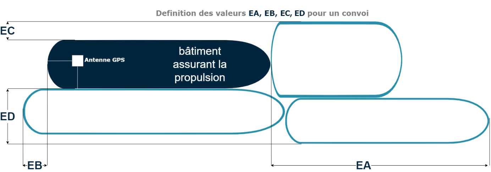

# How do I set the Reference point for the positional information aboard the vessel?

La surface occupée par le bateau est fournie en référence à l'antenne GPS de l'appareil AIS Intérieur qui, à bord du bateau, constitue le point d’acquisition de l'information relative à la position du bateau. Les valeurs A, B, C et D correspondent à la distance entre l'antenne GPS et la proue \(A\), la poupe \(B\), le côté bâbord \(C\) et le côté tribord \(D\) du bateau.

## **A\) Saisie des valeurs A, B, C et D lors de l'installation**

Les valeurs A, B, C et D sont saisies avec une précision de 1 m lors de l'installation de l'appareil AIS Intérieur par la société spécialisée agréée. La longueur et la largeur hors tout du bateau sont saisies avec une précision de 0,1 m.

Si le bateau n'est pas un convoi, ces valeurs ne changent pas. Le conducteur n'a plus à intervenir.

Figure A\) : la position de l'antenne GPS à bord du bateau est saisie lors de l'installation \(les valeurs A, B, D, C se réfèrent à l'antenne GPS par rapport au contour du bateau\).

## **B\) Saisie des valeurs A, B, C et D pour un convoi**

Pour un convoi, les valeurs A, B, C et D doivent être modifiées lorsque la composition du convoi est modifiée. Les valeurs A, B, C et D correspondent toujours à la surface totale occupée par le convoi, qui comprend le pousseur et toutes les barges du convoi.

Lorsque les contours du convoi sont modifiés, le conducteur doit modifier en conséquence les valeurs A, B, C, et D dans l'appareil AIS Intérieur.

En fonction de l'âge de l'appareil AIS Intérieur, il existe deux procédures différentes pour modifier ces valeurs.

## **B1\) Saisie des valeurs A, B, C et D dans les appareils AIS Intérieur installés avant le 1er décembre 2015**

Pour les appareils AIS Intérieur qui ont été installés avant le 1er décembre 2015 \(numéro d'agrément de type R-4-200 à R-4-222\), le conducteur doit modifier les valeurs A, B, C et D en fonction du contour du convoi, avec une précision de 1 m.

Cette tâche étant un peu fastidieuse, certains appareils ECDIS Intérieur proposent un menu de configuration spécial qui facilite la saisie de ces données.

Figure B1 : les valeurs A, B, C et D représentant la position de l'antenne GPS sur le convoi doivent être modifiées par le conducteur à chaque fois que la composition du convoi est modifiée, afin de correspondre aux dimensions hors-tout du convoi \(les valeurs A, B, C et D correspondent au contour du bateau à partir de l'antenne GPS\).

Ceci s'applique pour les appareils AIS Intérieur qui ont été installés avant le 1er décembre 2015 \(numéros d'agrément de type de R-4-200 à R-4-222\).

## **B1\) Saisie des valeurs A, B, C et D dans les appareils AIS Intérieur installés après le 1er décembre 2015**

Pour tous les appareils AIS Intérieur installés après le 1er décembre 2015 \(numéros d'agrément de type de R-4-300 à R-4-3xx\), le conducteur n'a pas besoin de modifier les valeurs A, B, C et D lorsque les contours du convoi ont changé. À la place, il doit saisir les valeurs correspondant à l'allongement résultant du remorquage de barges.

Ces valeurs en mètres, avec une précision de 0,1 m, sont :

* EA : L'extension à l'avant du pousseur ou remorqueur
* EB : L'extension à l'arrière,
* EC : L'extension à bâbord,
* ED : L'extension à tribord.

> La longueur et la largeur hors-tout sont calculées automatiquement sur cette base et transmises par l'appareil AIS Intérieur.

Là encore, certains appareils ECDIS Intérieur proposent un menu de configuration spécial pour faciliter la saisie de ces données.

Ces valeurs doivent être saisies par le conducteur à chaque modification du convoi. Cela s'applique aux appareils AIS Intérieur qui ont été installés après le 1er décembre 2015 \(numéros d'agrément de type de R-4-300 à R-4-3xx\).

Conformément à l’article 1.01, lettre l\) du Règlement de police pour la navigation du Rhin, un bac est un bateau qui assure un service de traversée de la voie navigable et qui est classé comme bac par l’autorité compétente.

