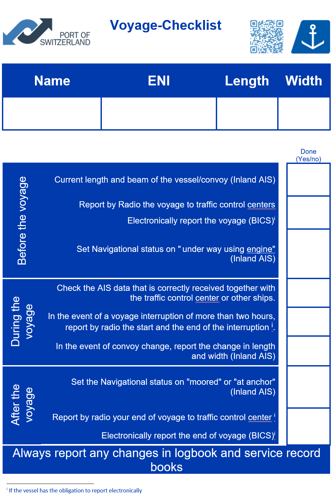

# Voyage-Checklist

This page references checklists to be used during voyage to fulfil the obligations of carriage and use of Inland AIS. Note that these checklists are examples and not exhaustive and that they could always be completed according to regional regulations.

This checklist should help the boatmaster operate the Inland AIS device on board the vessel. The purpose is to give a short overview of what kind of data should be input and kept up to date during the voyage of the inland vessel. The current minimum requirement of the data input may differ between regions. The minimum requirements of the data content are published in the appropriate regional regulation of the river commission or the national legislation.

Before the voyage starts, check that the Inland AIS device is switched on.

**Before the voyage**

Check your own vessel data transmitted by the Inland AIS device \(once in a while\):

* Name of the vessel.
* ENI number.
* ERI vessel and convoy type.
* Length and beam of vessel.
* Reference point of the GPS antenna.
* If blue sign is connected, check
  * that blue sign status is correct.
* Check if you are receiving data from other vessels \(which you may see visually\) on the electronic chart display systems

**Shortly before starting the voyage**

Amend your own vessel’s data for the planned voyage according to the regional regulation for the waterway where you are navigating:

* Dangerous cargo indication.
* Destination.
* Depth.
* In case of convoy:
  * Length and
  * beam of convoy and the reference point of the GPS antenna. Also, if the previous voyage was a convoy it should be adjusted accordingly.
* Set the navigational status information of the vessel to “underway” with respect to the navigational status that is applicable.

**During the voyage**

* Keep the navigational status information of the vessel up to date.
* Check if you are receiving data from other vessels \(which you may see visually\).

**After the voyage**

* Set the navigational status information to “moored” or “at anchor”.
* Amend the voyage-related data if necessary.
* Operate the Inland AIS device according to the regional regulation for the waterway/port of navigation.


Keep in mind !

Record actions in the logbook and service records.


