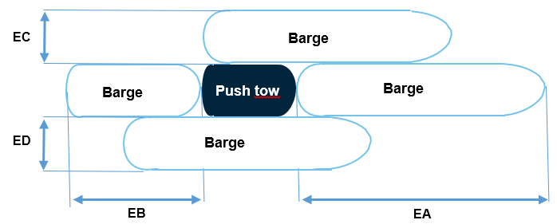

# How do I set the Reference point for the positional information aboard the vessel?

The counter of the vessel is provided with reference to the Inland AIS station’s GPS antenna, which is the point for the positional information aboard the vessel. The values A, B, C and D provides the distance from the GPS antenna to the bow \(A\), the stern \(B\), the port side \(C\) and the starboard side \(D\) of the vessel.

## A\) Input of Values A, B, C and D during installation

The values A, B, C and D are entered with an accuracy of 1 m during the installation of the Inland AIS station by the approved specialised firm. The overall length and beam of the vessel is input with an accuracy of 0.1 m.

In cases where the vessel is not a convoy those values do not change. No further action by the skipper is required.

Figure A\): The position of the GPS antenna on the vessel is input during installation \(values A, B, D, C refers from the GPS antenna to the outline of the vessel\)

## B\) Input of Values A, B, C and D in case of a convoy

In case of a convoy the values A, B, C and D needs to be changed when the setting of the convoy is changed. The A, B, C and D value always represents the overall counter of the vessel which includes the pusher and all connected barges.

The skipper needs to amend the A, B, C, D values accordingly in the Inland AIS station when the outline of the convoy is changed.

There are two different procedures to change those values depending on the age of the Inland AIS station.

## B1\) Input of Values A, B, C and D in Inland AIS station installed before December 1st 2015

At Inland AIS stations which are installed before December 1st 2015 \(type approval number R-4-200 to R-4-222\) the skipper needs to change the A, B, C, D values according the outline of the convoy with an accuracy of 1 m. The overall length and beam need to be input with the accuracy of 0,1 m.

Admittedly this is a kind of cumbersome for which reason some Inland ECDIS devices offer a special configuration menu to support the input of those data.

Figure B1 : The A, B, C, D value representing the position of the GPS antenna on the convoy needs to be amended by the skipper whenever the setting of the convoy is changed to reflect the overall contour of the convoy \(values A, B, D, C refers from the GPS antenna to the outline of the vessel\).

This applies to Inland AIS stations which are installed before December 1st 2015 \(type approval number R-4-200 to R-4-222\).

## B1\) Input of Values A, B, C and D in Inland AIS station installed after December 1st 2015

At Inland AIS stations which are installed after December 1st 2015 \(type approval number R-4-300 to R-4-3xx\) the skipper does not needs to change the A, B, C, D values directly according the change of the outline of the convoy. These values will be calculated automatically. Instead the values for the extension to the push tow caused by the barges shall be input. The extension in front of the of the push tow \(EA\), the extension at the rear \(EB\), at the port side \(ED\) and at the starboard side \(EC\) is input with the accuracy of 0,1 m. The overall length and beam is calculated automatically with the accuracy of 0,1 m.

Here as well some Inland ECDIS devices offer a special configuration menu to support the input of those data.

Figure B2: The outline of the convoy is given by the extension to the push tow caused by the barges coupled to the push tow \(EA, EB, EC, ED\). Those values must be input by the skipper whenever the convoy is changed. This applies to Inland AIS stations which are installed after December 1st 2015 \(type approval number R-4-300 to R-4-3xx\).

