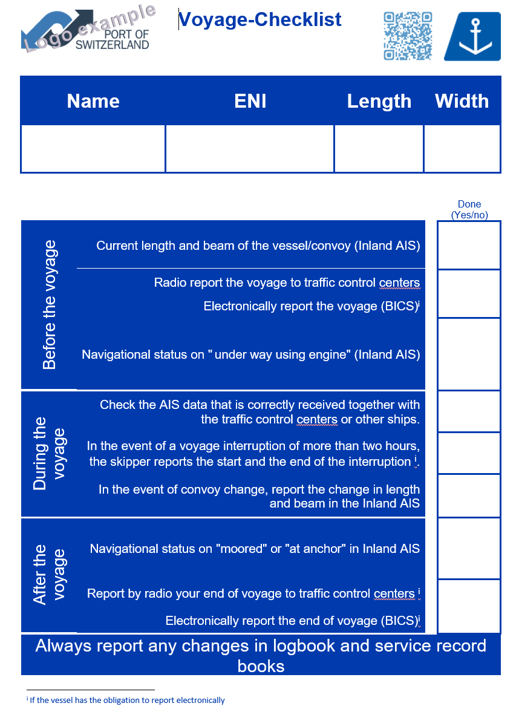

# allin

Document d'information électronique relatif aux appareils AIS Intérieur, aux appareils ECDIS Intérieur et aux appareils comparables pour la visualisation de cartes électroniques

## Introduction - Appareil AIS Intérieur sur le Rhin

Sur le Rhin, l'obligation d'installer et d'utiliser un appareil AIS Intérieur connecté à des systèmes de visualisation de cartes électroniques est entrée en vigueur le 1er décembre 2014.

Lorsque l'expression « système de visualisation de cartes électroniques » est utilisée dans le présent document, il s'agit :

* d'un appareil ECDIS Intérieur en mode information
* ou d'un appareil comparable pour la visualisation de cartes électroniques.

Entre 2016 et 2017, la Commission centrale pour la navigation du Rhin \(CCNR\) a mené une étude auprès des bateliers, des autorités et des sociétés installatrices. Le principal résultat de cette étude a été que l'appareil AIS Intérieur \(en combinaison avec un système de visualisation de cartes électroniques\) est largement accepté comme un outil de soutien pour une navigation rhénane plus sûre.

Le présent document, destiné aux membres d'équipage, vise à clarifier l'importance et à assurer l'utilisation correcte de l'appareil AIS Intérieur en combinaison avec un système de visualisation de cartes électroniques, en répondant aux questions concrètes soulevées par les usagers lors de l'enquête.

Le document de la CCNR « Précisions concernant l’obligation d’équipement en appareil AIS Intérieur et en appareil ECDIS Intérieur ou en appareil comparable pour la visualisation de cartes »[\[1\]]() \(disponible en anglais, français, allemand et néerlandais[\[2\]]()\) contient des précisions relatives à l’obligation d'être « équipé d'un appareil AIS Intérieur et de systèmes de visualisation de cartes électroniques et à leur utilisation ».

## Qu'est-ce qu'un appareil AIS Intérieur ?

L'appareil AIS \(Automatic identification system / Système d'identification automatique\) est un transpondeur qui fournit un système de communication et d'identification automatique destiné à améliorer la sécurité de la navigation en contribuant à l'exploitation efficace des services de trafic fluvial \(VTS\), de notification, ainsi qu'aux opérations de bateau à bateau et du bateau à la terre. Le système d'identification automatique \(AIS\), d'abord utilisé pour la navigation maritime, est opérationnel pour la navigation intérieure sur le Rhin depuis 2010. Il s'agit d'un système de suivi automatique embarqué, qui fournit des informations relatives au bateau aux autres bateaux et à des organisations à terre telles que les centres de services d'information fluviale \(SIF\). De même, l'appareil AIS recueille des informations provenant d'autres bateaux et d'organisations à terre.

Le transfert des informations se fait au moyen d'appareils AIS Intérieur installés à bord des bateaux. Les appareils AIS Intérieur intègrent des capteurs électroniques tels qu'un système de positionnement global \(GPS\), pour déterminer la position du bateau en temps réel, et un émetteur-récepteur à très haute fréquence \(VHF\), pour transmettre des données dans les deux sens.

## Comment installer un appareil AIS Intérieur ?

Les conducteurs ne peuvent pas installer eux-mêmes l'appareil AIS Intérieur. L'appareil AIS Intérieur doit être installé par des entreprises spécialisées et agréées \(sociétés installatrices\).

### Liste des sociétés installatrices agréées

La liste des sociétés installatrices est disponible sur une page dédiée du [CESNI](https://listes.cesni.eu/5000-en.html) qui peut être consultée ci-dessous

[&lt;LIEN VERS la liste des](https://listes.cesni.eu/5000-en.html%22%20/t%20%22_blank) [sociétés installatrices](https://listes.cesni.eu/5000-en.html%22%20/t%20%22_blank)[&gt;](https://listes.cesni.eu/5000-en.html%22%20/t%20%22_blank)

Lorsqu'un bateau est dans l'obligation d'être équipé d'un appareil AIS Intérieur, seul l'un des appareils figurant dans la liste ci-dessus peut être utilisé.

Si votre bateau est dans l'obligation d'être équipé d'un appareil AIS Intérieur, seul un appareil AIS intérieur pour lequel est indiqué « **Montage autorisé** » peut être installé.

## Quelles mesures doivent prendre les conducteurs si l'appareil AIS Intérieur est défectueux ?

Durant son utilisation, l’appareil AIS Intérieur doit fonctionner de manière fiable et être en bon état de fonctionnement.

Un appareil AIS Intérieur défectueux entraînera des **erreurs d'appréciation** entre les conducteurs et des **situations dangereuses** sur les voies navigables.

C'est pourquoi un appareil AIS Intérieur défectueux doit être réparé immédiatement ou remplacé par un appareil en bon état de fonctionnement. Aucun voyage ne peut être entamé sans un appareil AIS Intérieur en bon état de fonctionnement et mis en marche.

En cas de dysfonctionnement, la mise hors tension et le redémarrage \(reboot\) de l'appareil AIS Intérieur sont susceptibles de contribuer à rétablir le bon état de fonctionnement.

Un appareil AIS Intérieur peut subir une panne. Dans ce cas, la CCNR recommande aux États riverains du Rhin d'appliquer les règles de flexibilité suivantes :

* La navigation peut être poursuivie pendant une durée maximale de 48 heures avec un appareil AIS Intérieur ne transmettant pas de données, afin que le bateau puisse se rendre au port de chargement ou de déchargement le plus proche ou, à défaut, si ce port est trop éloigné, en un lieu où l'appareil défectueux peut être réparé ou remplacé. La poursuite du voyage avec un appareil AIS Intérieur défectueux engage l'entière responsabilité du conducteur.
* **Aucun voyage ne peut être entamé sans un appareil AIS Intérieur en bon état de fonctionnement et mis en marche.**
* Compte tenu de la nature particulière des voyages effectués par les bacs et les bateaux d'excursions journalières, les deux paragraphes ci-avant ne s'appliquent pas à ces deux catégories de bateaux. Pour un bac, la navigation peut se poursuivre pendant une période maximale de 24 heures avec un appareil AIS Intérieur ne transmettant pas de données. Pour un bateau d'excursions journalières, la navigation peut se poursuivre pendant une période maximale de 48 heures avec un appareil AIS Intérieur ne transmettant pas de données.
* Si l'appareil AIS Intérieur ne transmet plus de données, le conducteur du bateau **doit immédiatement en informer par radio la centrale de secteur** et fournir des rapports réguliers sur la voie VHF bateau-bateau jusqu'à ce que l'appareil AIS Intérieur soit à nouveau opérationnel.

Si l'appareil AIS Intérieur est défectueux, il doit être réparé par une société spécialisée agréée \(société installatrice\).

## Quel est l'avantage d'utiliser l'appareil AIS Intérieur pour le conducteur ?

Les informations transmises et reçues par l'appareil AIS Intérieur affichées sur les systèmes de visualisation de cartes électroniques ne dispensent pas le conducteur de surveiller le trafic au moyen de l'image radar et en regardant par la fenêtre de la timonerie.

Seuls les bateaux équipés d'un appareil AIS Intérieur sont visibles sur l'écran, or tous les bateaux ne sont pas équipés d'un appareil AIS Intérieur.

Un appareil AIS Intérieur **en combinaison avec un appareil ECDIS Intérieur** \(ou un appareil comparable de visualisation de cartes électroniques\) permet aux conducteurs :

* de **transmettre régulièrement** le nom, la position, la vitesse et le cap de leur bateau aux autres **bateaux à proximité** équipés d'un appareil AIS Intérieur,
* d'afficher sur l'écran du système de visualisation de cartes électroniques le nom et la position des bateaux présents à proximité \(uniquement de ceux qui sont aussi équipés d'un appareil AIS Intérieur en état de marche\),
* d'obtenir des informations permettant de prendre les mesures nécessaires pour naviguer en toute sécurité \(en combinaison avec le fait de regarder par la fenêtre et de consulter les données provenant d'autres appareils de navigation\).

Si le radar permet également de localiser d'autres bateaux situés à proximité, la portée utile du radar est toutefois limitée par rapport à celle de l'appareil AIS, en particulier sur les voies de navigation intérieure. En effet, un appareil AIS Intérieur a une **portée bien plus étendue** et permet d'afficher des bateaux se trouvant de l'autre côté d'un obstacle, tel qu'une montagne.

L'appareil AIS Intérieur fournit ainsi au conducteur une **aide à la navigation**. **Cependant, l'AIS Intérieur combiné à un système de visualisation de cartes électroniques n'est pas un système de navigation au même titre qu'un radar.**

Les conducteurs doivent prendre connaissance des informations fournies par l'appareil AIS Intérieur et les utiliser pour assurer la sécurité et le bon ordre de la navigation. Ces informations doivent être utilisées correctement et d'une manière conforme au « devoir de vigilance » des conducteurs.

## Quels sont les différents types d'appareils AIS ?

De manière générale, il existe trois types d'appareils AIS :

* **Appareil AIS Intérieur**
* appareil AIS de classe A
* appareil AIS de classe B

### Appareils AIS Intérieur

Un bateau naviguant sur le Rhin qui est soumis à l'obligation d'être équipé d'un appareil AIS Intérieur \(voir le point QR7\) doit être équipé d'un appareil AIS Intérieur possédant un agrément de type.

L'agrément de type signifie que l'appareil AIS Intérieur doit être conforme aux exigences du Standard d'essai pour l'AIS Intérieur. La conformité est certifiée par un examen de l'agrément de type par une autorité compétente.

Ces bateaux naviguant sur le Rhin doivent être équipés d'appareils AIS Intérieur possédant un agrément de type. Les règles suivantes s'appliquent en ce qui concerne l'édition du standard d'essai AIS à satisfaire :

* Les appareils AIS Intérieur qui ont été certifiés avant le 19 octobre 2012 doivent être conformes aux exigences du Standard d’essai édition 1.0 ou 1.01 de la CCNR et les appareils qui ont été certifiés après cette date doivent être conformes aux exigences du Standard d’essai édition 2.0. de la CCNR. Les appareils AIS Intérieur certifiés conformément à l'édition 1.0 ou 1.01 portent un numéro d'agrément de type attribué par la Commission centrale pour la navigation du Rhin \(CCNR\) selon le format suivant : R-4-2XX \(X représente un chiffre\).
* Il était possible d'installer un équipement AIS Intérieur avec un agrément de type conforme à l'édition 1.0 et 1.01 jusqu'au 30 novembre 2015. Les appareils déjà installés peuvent être utilisés après cette date.
* Depuis le 1er décembre 2015, seuls les appareils AIS Intérieur possédant un agrément de type conforme aux exigences du Standard d'essai AIS Intérieur 2017/édition 2.0 du standard d'essai pourront être installés. Les appareils AIS Intérieur possédant un agrément de type conformément à l'édition 2.0 portent un numéro d'agrément de type attribué par la Commission centrale pour la navigation du Rhin \(CCNR\) selon le format suivant : R-4-3XX \(X représente un chiffre\).

Il est prévu que, à compter du 1er janvier 2024, seuls les appareils AIS Intérieur possédant un agrément de type conforme à l'édition 3.0 du Standard d'essai AIS Intérieur pourront être installés. Les appareils déjà installés pourront être utilisés après cette date. En effet, à compter du 1er janvier 2022 \(date prévue de l'entrée en vigueur de l'ES-TRIN 2021/1\), le « Standard d'essai pour l'AIS intérieur 2021/édition 3.0 » sera applicable.

### Appareils AIS de classe A

Les appareils AIS de classe A doivent respecter les prescriptions de l’OMI \(Organisation Maritime Internationale\). Les appareils AIS de classe A sont largement utilisés dans la navigation maritime.

Un bateau naviguant sur le Rhin qui est soumis à l'obligation d'être équipé d'un appareil AIS Intérieur \(voir le point QR7\) ne peut pas être équipé uniquement d'un appareil AIS de classe A.

### Appareils AIS de classe B

Les appareils AIS de classe B disposent de fonctionnalités limitées par rapport aux appareils AIS de classe A. Les appareils AIS de classe B peuvent être utilisés, par exemple, par les bateaux de plaisance. Les appareils AIS de classe B doivent être conformes :

* aux exigences pertinentes de la recommandation ITU-R.M 1371 de la directive 2014/53/UE \(RED\),
* au standard international CEI 62287-1 ou 2 \(y compris la gestion des canaux ASN\).

## Quand est-il obligatoire d'installer l'appareil AIS Intérieur ?

### Bateaux qui doivent être équipés d’un appareil AIS Intérieur

L’obligation de posséder un appareil AIS Intérieur est décrite de manière précise dans l’article 4.07 du Règlement de police pour la navigation du Rhin \(RPNR\).

Cette obligation d'équipement avec un appareil AIS Intérieur s'applique à tous les bateaux, y compris les navires de mer, les bacs, les petits bateaux de police équipés d'un radar et les menues embarcations en possession d'un certificat de visite conforme au Règlement de visite des bateaux du Rhin ou d'un certificat réputé équivalent conformément à ce règlement.

Seuls les bateaux mentionnés ci-dessous ne sont pas soumis à cette obligation.

### Bateaux exemptés

Les bateaux suivants ne sont pas soumis à l’obligation d’être équipés d’un appareil AIS Intérieur :

a\) les bateaux de convois poussés et de formations à couple, à l’exception du bateau qui assure la propulsion principale,

b\) les menues embarcations, à l'exception :

* des bateaux de police équipés de radars,
* des bateaux possédant un certificat de visite conformément au Règlement de visite des bateaux du Rhin ou un certificat réputé équivalent conformément à ce règlement,
* des barges de poussage sans système de propulsion propre,
* des engins flottants sans système de propulsion propre.

L’obligation de mettre en fonctionnement l’appareil AIS est explicitée au point QR17 du présent document.

Pour les bateaux cités non soumis à l’obligation d’équipement, il est recommandé d’utiliser un appareil AIS Intérieur agréé \(et non un appareil de classe A ou B\) en vertu du RVBR, dans la mesure où l’appareil AIS Intérieur est conçu pour la réception d’annonces spécifiquement destinées à la navigation intérieure.

Toutefois, pour les bateaux de plaisance qui sont des menues embarcations, la Commission centrale pour la navigation du Rhin recommande qu’ils soient équipés d’un appareil AIS de classe B.

Les menues embarcations non soumises à l’obligation de posséder l’équipement AIS Intérieur doivent également, si elles souhaitent s’équiper en appareil AIS, posséder une installation de radiotéléphonie en bon état de fonctionnement et commutée sur écoute pour le réseau bateau-bateau.

Définition : conformément à l'article 1.01, lettre m\) du Règlement de police pour la navigation du Rhin, une « menue embarcation » est un bateau dont la longueur maximale de la coque, gouvernail et beaupré non compris, est inférieure à 20 m, sauf s'il s'agit :

* d’un bateau autorisé à remorquer, pousser ou mener à couple des bateaux qui ne sont pas de menues embarcations,
* d’un bateau autorisé au transport de plus de 12 passagers,
* d'un bac,
* d'une barge de poussage.

### Spécificité de certains bateaux

À l’instar des bateaux de la navigation commerciale, les bateaux de la police équipés d’un appareil radar doivent également être équipés d’un appareil AIS Intérieur, bien qu’il s’agisse souvent de « menues embarcations ».

Les bateaux de l’administration possèdent en général un certificat de visite conformément aux prescriptions du RVBR ou un certificat réputé équivalent en vertu de ce règlement. À ce titre, ils doivent également être équipés d’un appareil AIS Intérieur.

### Certificats relatifs à l’assignation de fréquences

Tous les bateaux équipés d’un appareil AIS Intérieur ou d’un appareil radar ou d’une installation de radiotéléphonie doivent posséder à leur bord le ou les « Certificat\(s\) relatif\(s\) à l’assignation de fréquences » ou la « Licence de station de navire » conformément à l’article 1.10, lettre l du Règlement de police pour la navigation du Rhin.

Cette demande de certificat ou de licence est à effectuer auprès des autorités compétentes dès que l’appareil AIS a été acquis. Le conducteur doit s’assurer que le propriétaire ou l’exploitant du bateau a fait cette demande. Dans tous les cas, il incombe au conducteur de vérifier que ce certificat ou cette licence est à bord du bateau.

### Puis-je installer un appareil AIS Intérieur même si je n'y suis pas obligé ?

Pour les bateaux cités non soumis à l’obligation d’équipement, il est recommandé d’utiliser un appareil AIS Intérieur agréé \(et non un appareil de classe A ou B\), dans la mesure où l’appareil AIS Intérieur est conçu pour la réception d’annonces spécifiquement destinées à la navigation intérieure. Toutefois, pour les bateaux de plaisance qui sont des menues embarcations, la CCNR recommande de s’équiper avec un appareil AIS de classe B.

Les menues embarcations \(et notamment les bateaux de plaisance\), qui ne sont pas soumises à l’obligation d’équipement en appareil AIS et qui décident de s’équiper d’un appareil AIS de classe B ne sont pas tenues de recourir à une société spécialisée agréée pour l’installation de cet appareil. Cependant, la CCNR recommande de faire appel aux services d’une société spécialisée agréée, afin de réduire le risque de dysfonctionnements.

## Supprimé

## Quels sont les champs de données les plus courants d'un appareil AIS Intérieur ?

Il est obligatoire que l'appareil AIS Intérieur transmette des données actualisées. Aussi, cette page contient quelques indications pour le conducteur et explique \(le cas échéant\) le but de l'utilisation de ces données. Pour les opérations quotidiennes, le conducteur peut également utiliser la [liste de contrôle](https://ris.gitbook.io/ebrochure-iais/voyage-checklist).

<table>
  <thead>
    <tr>
      <th style="text-align:left">Champ de donn&#xE9;es</th>
      <th style="text-align:left">Description</th>
    </tr>
  </thead>
  <tbody>
    <tr>
      <td style="text-align:left"><b>Identifiant utilisateur (num&#xE9;ro MMSI)</b>
      </td>
      <td style="text-align:left">Le num&#xE9;ro MMSI est le num&#xE9;ro d&apos;identit&#xE9; de l&apos;appareil
        AIS Int&#xE9;rieur &#xE9;metteur qui est attribu&#xE9; aux &#xE9;quipements
        de radiocommunication embarqu&#xE9;s par l&apos;administration des t&#xE9;l&#xE9;communications
        comp&#xE9;tente. Le num&#xE9;ro MMSI attribu&#xE9; est saisi par la soci&#xE9;t&#xE9;
        sp&#xE9;cialis&#xE9;e agr&#xE9;&#xE9;e lors de l&apos;installation de l&apos;appareil
        AIS Int&#xE9;rieur. Ce num&#xE9;ro permet aux syst&#xE8;mes de gestion
        du trafic fluvial des autorit&#xE9;s d&apos;identifier un bateau et de
        faire le lien avec les donn&#xE9;es actuelles concernant son voyage.</td>
    </tr>
    <tr>
      <td style="text-align:left"><b>Nom du bateau</b>
      </td>
      <td style="text-align:left">Le nom du bateau est saisi dans l&apos;appareil AIS Int&#xE9;rieur lors
        de son installation par la soci&#xE9;t&#xE9; sp&#xE9;cialis&#xE9;e agr&#xE9;&#xE9;e.
        Le nom du bateau permet au conducteur d&apos;identifier le trafic environnant.</td>
    </tr>
    <tr>
      <td style="text-align:left"><b>Type de bateau ou de convoi</b>
      </td>
      <td style="text-align:left">Le <a href="https://ris.gitbook.io/ebrochure-iais/how-to-set-a-convoy-or-a-towed-convoy-in-the-inland-ais-device"><em>type de bateau ou de convoi</em></a> est
        utilis&#xE9; par les syst&#xE8;mes de gestion du trafic fluvial des autorit&#xE9;s
        afin de d&#xE9;terminer la composition d&apos;un convoi et/ou de planifier
        les cycles d&apos;&#xE9;clusage. L&apos;AIS Int&#xE9;rieur fournit une
        liste des diff&#xE9;rents types de bateaux et de convois pour faire le
        choix. Pour un convoi, le type de convoi peut changer pour chaque bateau
        en fonction du nombre et du type des barges accoupl&#xE9;es. Pour certains
        bateaux, le type peut &#xE9;galement changer. Il doit &#xEA;tre mis &#xE0;
        jour par le conducteur pour chaque voyage.</td>
    </tr>
    <tr>
      <td style="text-align:left"><b>Num&#xE9;ro ENI</b>
      </td>
      <td style="text-align:left">Le num&#xE9;ro ENI est le num&#xE9;ro europ&#xE9;en unique d&apos;identification
        des bateaux. Il est saisi par la soci&#xE9;t&#xE9; sp&#xE9;cialis&#xE9;e
        agr&#xE9;&#xE9;e lors de l&apos;installation de l&apos;appareil AIS Int&#xE9;rieur.
        Le num&#xE9;ro ENI est utilis&#xE9; par les syst&#xE8;mes de gestion du
        trafic fluvial des autorit&#xE9;s pour identifier les bateaux et faire
        le lien avec les donn&#xE9;es actuelles concernant leur voyage.</td>
    </tr>
    <tr>
      <td style="text-align:left"><b>Dimensions</b>
      </td>
      <td style="text-align:left">
        
Les dimensions sont la longueur et la largeur hors tout du bateau ou du
          convoi. Pour un bateau seul, ces valeurs sont saisies par la soci&#xE9;t&#xE9;
          sp&#xE9;cialis&#xE9;e agr&#xE9;&#xE9;e lors de l&apos;installation de l&apos;appareil
          AIS Int&#xE9;rieur. Pour un convoi, les valeurs doivent &#xEA;tre fix&#xE9;es
          par le conducteur en fonction de la composition actuelle du convoi. Le
          conducteur prend en compte les dimensions des autres bateaux afin d&apos;assurer
          la s&#xE9;curit&#xE9; lors des croisements et d&#xE9;passements.

        
Les autorit&#xE9;s prennent en compte les dimensions dans leurs syst&#xE8;mes
          de gestion du trafic fluvial pour la planification des &#xE9;clusages et/ou
          pour les services VTS.

      </td>
    </tr>
    <tr>
      <td style="text-align:left"><b>Position</b>
      </td>
      <td style="text-align:left">La position est utilis&#xE9;e pour afficher le bateau sur une carte. Cette
        information sur la position d&apos;un bateau refl&#xE8;te la position r&#xE9;elle
        de l&apos;antenne GPS de l&apos;appareil AIS Int&#xE9;rieur &#xE0; bord
        du bateau. La position est utilis&#xE9;e par d&apos;autres conducteurs
        et par les autorit&#xE9;s.</td>
    </tr>
    <tr>
      <td style="text-align:left"><b>Vitesse sur route</b>
      </td>
      <td style="text-align:left">
        
La vitesse sur route est transmise automatiquement par l&apos;appareil
          AIS Int&#xE9;rieur. Le conducteur utilise la vitesse pour d&#xE9;terminer
          si un bateau se d&#xE9;place et &#xE0; quelle vitesse.

        
Les syst&#xE8;mes de gestion du trafic fluvial des autorit&#xE9;s pourraient
          utiliser la vitesse sur terre pour d&#xE9;terminer si un bateau se d&#xE9;place.
          Cela permet de distinguer les bateaux qui font route de ceux qui sont amarr&#xE9;s.

      </td>
    </tr>
    <tr>
      <td style="text-align:left"><b>Route</b>
      </td>
      <td style="text-align:left">La route du bateau est transmise automatiquement par l&apos;appareil AIS
        Int&#xE9;rieur. Elle est utilis&#xE9;e par le conducteur et les autorit&#xE9;s
        pour d&#xE9;terminer le sens de navigation d&apos;un bateau.</td>
    </tr>
    <tr>
      <td style="text-align:left"><b>Statut navigationnel</b>
      </td>
      <td style="text-align:left">Le statut navigationnel donne une indication sur le statut d&apos;exploitation
        du bateau (par exemple, &#xAB; en route au moteur &#xBB;, &#xAB; &#xE0;
        l&apos;ancre &#xBB;, &#xAB; amarr&#xE9; &#xBB;) et rel&#xE8;ve de la responsabilit&#xE9;
        du conducteur). Les syst&#xE8;mes de gestion du trafic fluvial des autorit&#xE9;s
        utilisent ces informations &#xE0; des fins de planification. Le statut
        navigationnel rev&#xEA;t peut-&#xEA;tre une moindre importance pour le
        conducteur, mais il permet de tenir compte du fait qu&apos;un appareil
        AIS Int&#xE9;rieur qui transmet avec le statut navigationnel &#xAB; en
        route, au moteur &#xBB; n&#xE9;cessite nettement plus de temps pour la
        transmission qu&apos;avec le statut navigationnel &#xAB; amarr&#xE9; &#xBB;.
        En particulier dans les secteurs o&#xF9; le trafic est dense, (par ex.
        dans les ports), le fait de r&#xE9;gler le statut navigationnel sur &quot;amarr&#xE9;&quot;
        lorsqu&apos;un bateau est amarr&#xE9; permet de moins solliciter le syst&#xE8;me.
        Le statut navigationnel est r&#xE9;gl&#xE9; par le conducteur, mais certains
        fournisseurs (notamment les fabricants d&apos;appareils ECDIS Int&#xE9;rieur)
        proposent une fonctionnalit&#xE9; de param&#xE9;trage (semi-)automatique
        du statut navigationnel sur la base de la vitesse sur route. Le conducteur
        demeure toutefois responsable des informations transmises.</td>
    </tr>
    <tr>
      <td style="text-align:left"><b>Point de r&#xE9;f&#xE9;rence</b>
      </td>
      <td style="text-align:left">Le point d&apos;acquisition de l&apos;information du bateau est, dans
        la plupart des cas, la position de l&apos;antenne GPS de l&apos;appareil
        AIS. Le point d&apos;acquisition de l&apos;information est saisi par la
        soci&#xE9;t&#xE9; sp&#xE9;cialis&#xE9;e agr&#xE9;&#xE9;e lors de l&apos;installation
        de l&apos;appareil AIS Int&#xE9;rieur. La modification du point d&apos;acquisition
        de l&apos;information n&apos;est n&#xE9;cessaire que pour les convois,
        en fonction de la composition du convoi. Cette modification est g&#xE9;n&#xE9;ralement
        effectu&#xE9;e en m&#xEA;me temps que la modification des dimensions du
        convoi. Si le point d&apos;acquisition de l&apos;information n&apos;est
        pas r&#xE9;gl&#xE9; correctement, cela peut donner lieu &#xE0; un d&#xE9;calage
        par rapport &#xE0; la position r&#xE9;elle du bateau.</td>
    </tr>
  </tbody>
</table>

## Quelles sont les données transmises par l'appareil AIS ?

Les données transmises par l'appareil AIS Intérieur doivent toujours être à jour, conformément à l'article 4.07, chiffre 2, du Règlement de police pour la navigation du Rhin. Il incombe au conducteur de s'assurer que toutes les données transmises par l'appareil AIS correspondent aux données actuelles concernant le bateau ou le convoi.

Les bateaux équipés d'un appareil AIS Intérieur transmettent automatiquement et périodiquement des informations et en reçoivent d'autres bateaux équipés d'un appareil AIS. Les principales informations concernent le bateau et ses données nautiques actuelles :

* identité du bateau,
* position exacte du bateau,
* cap et vitesse du bateau,
* autres données relatives au bateau.

Toutefois, certaines données doivent être saisies manuellement par le conducteur. Parmi celles-ci, les plus importantes sont les suivantes :

* statut navigationnel du bateau \(par ex. en route, amarré ou à l'ancre\),
* type de bateau / convoi,
* longueur et largeur hors tout du bateau / convoi.

[Quels sont les statuts navigationnels disponibles sur un appareil AIS Intérieur ?](https://ris.gitbook.io/ebrochure-iais/navigational-status)

[/statut-navigationnel](https://ris.gitbook.io/ebrochure-iais/navigational-status)

**Liste des données transmises obligatoirement par l’appareil AIS Intérieur**

Il existe un ensemble minimum de données devant être transmises par l'appareil AIS, qui doivent être disponibles à tout moment et maintenues à jour.

L'ensemble minimum de données devant être transmises par l'appareil AIS Intérieur est fixé à l'article 4.07, chiffre 4, du Règlement de police pour la navigation du Rhin :

| Ensemble de données | Description | Quand mettre à jour les données ? |
| :--- | :--- | :--- |
| MMSI | Maritime Mobile Service Identity = identité de l'appareil AIS | À chaque installation |
| Nom du bateau | Nom usuel du bateau sur les voies VHF | À chaque installation |
| Signal d'appel | Indicatif d’appel radio du bateau | À chaque installation |
| Type de bateau ou de convoi | En Référence à la liste de bateaux et de convois | À chaque voyage |
| ENI | Numéro européen unique d’identification du bateau \(ENI\) ou, pour les navires de mer auxquels n’a pas été attribué de numéro ENI, le numéro OMI | À chaque installation |
| Longueur | Longueur hors tout du bateau ou du convoi avec une précision de 0,1 m | À chaque voyage |
| Largeur | Largeur hors tout du bateau ou du convoi avec une précision de 0,1 m | À chaque voyage |
| Point d'acquisition de l’information relative à la position | Point d’acquisition de l’information relative à la position à bord du bateau, avec une précision de 1 m, \(il s'agit de la position de l'antenne GPS de l'appareil AIS Intérieur\), voir Annexe 2. | À chaque voyage |
| Position GNSS | Position du bateau \(dérivée du GPS dans le système de coordonnées WGS 84\) | Jamais \(automatique\) |
| Heure | Indication de l'heure de la détermination de la position par le dispositif électronique de détermination de la position | Jamais \(automatique\) |
| SOG | Vitesse au sol | Jamais \(automatique\) |
| COG | Cap au sol | Jamais \(automatique\) |
| NavStat | Statut navigationnel | À chaque manœuvre |

L'appareil AIS Intérieur peut fournir davantage de données, mais cela n'est pas obligatoire sur le Rhin et ces données peuvent être saisies sur une base volontaire.

La transmission de données supplémentaires s'étant souvent révélée une source de confusion, il est recommandé de ne transmettre que les données obligatoires énumérées ci-dessus et de ne pas transmettre de données supplémentaires telles que des informations sur le voyage du bateau.

La liste de contrôle accessible par le lien ci-dessous contient une liste des tâches à effectuer avant, pendant et après le voyage, y compris la modification des données relatives au convoi, s'il y a lieu.

## Saisie de données dans l'appareil AIS Intérieur

Le conducteur doit vérifier certaines données transmises par l'appareil AIS Intérieur au moins une fois avant chaque voyage. Par exemple, la configuration du convoi peut changer en fonction du voyage.

Si la configuration du convoi a été modifiée, le conducteur doit faire une mise à jour :

* Type de bateau ou de convoi
* Position du point d'acquisition de l'information \(antenne GPS\)

[Comment dois-je paramétrer le point d’acquisition de l'information relative à la position à bord du bateau](https://ris.gitbook.io/ebrochure-iais/reference-point-for-the-positional-information)[?](https://ris.gitbook.io/ebrochure-iais/reference-point-for-the-positional-information)

[/point-d’acquisition-de-l'information-relative-à-la-position](https://ris.gitbook.io/ebrochure-iais/reference-point-for-the-positional-information)

Vérifiez l'unité requise par l'appareil AIS Intérieur pour la position \(mètres ou décimètres par exemple\)

À titre d’exemple, pour un convoi d'une largeur de 12,54 m, le conducteur saisit dans l’appareil AIS Intérieur 12,6 m ou 126 dm, selon l’unité requise par l’appareil.

Pour les bateaux ne naviguant jamais en convoi, le point d'acquisition de l'information relative à la position peut être saisi définitivement par la société spécialisée agréée lors de l'installation de l'appareil.

### Pour les convois :

[Comment saisir les paramètres d'un convoi ou un convoi remorqué dans l'appareil AIS Intérieur ?](https://ris.gitbook.io/ebrochure-iais/how-to-set-a-convoy-or-a-towed-convoy-in-the-inland-ais-device)

[/comment-saisir-les-paramètres-d'un-convoi-ou-un-convoi-remorqué-dans-l'appareil-ais-intérieur](https://ris.gitbook.io/ebrochure-iais/how-to-set-a-convoy-or-a-towed-convoy-in-the-inland-ais-device)

### Données déterminées automatiquement par l'appareil AIS Intérieur

Le conducteur n'a pas besoin de procéder au paramétrage de l'appareil AIS Intérieur pour les données qui sont déterminées et transmises automatiquement. Ces données sont les suivantes :

* position \(coordonnées WGS84\) du bateau ou convoi où est installé l’appareil AIS Intérieur,
* vitesse sur route,
* route,
* heure de l’appareil électronique de détermination de la position.

### Paramètres saisis lors de l'installation de l'appareil AIS Intérieur

Ces paramètres doivent être modifiés après une modification concernant le bateau \(exemple : changement du propriétaire du bateau, changement de nom du bateau, allongement du bateau\).

Les paramètres énumérés ci-dessous sont saisis lors de l'installation de l'appareil AIS Intérieur. La saisie initiale \(et toute modification ultérieure\) doit être effectuée par une société spécialisée agréée. Toutefois, le conducteur doit s'assurer que la société spécialisée agréée a saisi les données correctement :

* identité de la station AIS \(MMSI\),
* nom du bateau,
* indicatif d'appel \(identification de la radio VHF du bateau\),
* Numéro européen unique d'identification des bateaux \(ENI\),
* longueur hors tout du bateau par rapport à l'antenne GPS embarquée, avec une précision de 0,1 m, voir annexe 2,
* largeur hors tout du bateau par rapport à l'antenne GPS embarquée, avec une précision de 0,1 m, voir annexe 2.

### Transmission de données incorrectes par l'appareil AIS Intérieur

Le conducteur doit vérifier régulièrement si les données transmises par l'appareil AIS Intérieur sont correctes. Cela peut être fait en examinant les paramètres dans les menus correspondants de l'appareil AIS Intérieur \(voir le manuel d'utilisation de l'appareil AIS Intérieur\).

Dans de rares cas, il est possible que l'appareil AIS Intérieur transmette des données incorrectes sans que le conducteur du bateau ne s'en aperçoive. La CCNR recommande par conséquent aux autres conducteurs de prendre l'initiative de contacter le conducteur du bateau dont l'appareil AIS Intérieur transmet des données incorrectes afin de l'alerter.

Le conducteur doit alors immédiatement corriger les données ou faire procéder à une correction par la société spécialisée agréée. Le fait de ne pas donner suite à cette demande le rend passible de poursuites.

## Comment saisir les données relatives à mon voyage dans l'appareil AIS Intérieur ?

Les Services d'information fluviale \(SIF\) sont susceptibles de fournir davantage de données, mais la transmission de ces données n'est pas obligatoire et leur saisie est facultative. La transmission de données supplémentaires s'étant souvent révélée être une source de confusion, il est recommandé de ne transmettre que les données obligatoires énumérées en QR10 et de ne pas transmettre de données supplémentaires telles que des informations sur le voyage du bateau.

Une liste de contrôle très utile contenant les tâches à effectuer avant, pendant et après le voyage est accessible ici :

[Liste de contrôle pour le voyage](https://ris.gitbook.io/ebrochure-iais/voyage-checklist)

[/liste-de-contrôle-pour-le-voyage](https://ris.gitbook.io/ebrochure-iais/voyage-checklist)

Il incombe au conducteur de s'assurer que les données transmises par l'appareil AIS Intérieur sont **constamment à jour**.

## Comment vérifier que les données transmises par l'appareil AIS Intérieur sont correctes ?

Le conducteur doit savoir quelles sont les données transmises par l'appareil AIS Intérieur afin de vérifier si ces données correspondent à la situation actuelle. Il existe plusieurs façons de procéder à cette vérification :

* Vérifiez si l'antenne est en position verticale.
* Vérifiez les paramètres de l'appareil AIS Intérieur. Différents menus de l'affichage intégral de l'appareil AIS intérieur \(appelé MKD - Minimum Keyboard Display\) permettent de paramétrer, de modifier et de vérifier les données transmises par l'appareil AIS Intérieur. Veuillez consulter le manuel d'utilisation du fabricant de l'appareil AIS Intérieur pour plus de précisions.
* Vérifiez les paramètres de l'appareil ECDIS Intérieur. De nombreux appareils ECDIS Intérieur permettent de paramétrer, de modifier et de vérifier les données transmises par l'appareil AIS Intérieur directement sur l'écran ECDIS Intérieur. Le conducteur peut se renseigner auprès du fournisseur de son appareil ECDIS Intérieur sur cette possibilité. Certains appareils comparables de visualisation de cartes électroniques permettent également d'effectuer cette vérification des paramètres ; si tel n'est pas le cas, la vérification des paramètres peut être effectuée directement sur l'appareil AIS Intérieur.
* Vérifiez les paramètres en appelant un centre SIF. La plupart des centres SIF disposent d'une vue d'ensemble complète des données AIS reçues. Un contrôle de validation peut être effectué en les contactant par VHF ou par téléphone.
* Vérifiez les données transmises en vous adressant à un autre conducteur de bateau. Chaque bateau équipé d'un appareil AIS Intérieur peut recevoir les données transmises par d'autres bateaux. Vous pouvez demander à un autre conducteur quelles sont les informations relatives à votre bateau qu'il reçoit.

### Vérifiez le statut de l'alerte et le statut du capteur de l'appareil AIS Intérieur

L'appareil AIS Intérieur génère une alerte et indique le statut du capteur en cas de défaillance de l'appareil ou des capteurs connectés \(par exemple le capteur GNSS ou l'antenne\). En vérifiant régulièrement les statuts, un problème peut être détecté à un stade précoce. Le code de l'alerte fournit une indication sur la nature du problème.

Il est utile d'informer la société installatrice de ces statuts d'alerte afin de lui permettre de faire le bon diagnostic.

## Quelles sont les exigences pour l'installation d'un appareil AIS Intérieur ?

### Installation d'un appareil AIS Intérieur

Un appareil AIS Intérieur doit être installé par une [société spécialisée agréée](https://ris.gitbook.io/ebrochure-iais/how-to-install-inland-nautical-equipment#list-of-approved-installing-firms).

Les entreprises sont uniquement agréées par une autorité compétente et sont répertoriées :

[Listes des autorités, sociétés, installations et équipements agréés conformément aux prescriptions techniques applicables aux bateaux de navigation intérieure](https://listes.cesni.eu/5000-en.html%22%20/t%20%22_blank)

[Listes des équipements possédant l'agrément de type, des autorités compétentes pour la délivrance des agréments de type, des services techniques agréés et des sociétés spécialisées agréées](https://listes.cesni.eu/5000-en.html%22%20/t%20%22_blank)

[listes.cesni.eu](https://listes.cesni.eu/5000-en.html%22%20/t%20%22_blank)

L'installation correcte effectuée par une société spécialisée agréée comprend :

* l'installation et la configuration de l'appareil AIS Intérieur,
* la vérification de son bon fonctionnement,
* la documentation de tous les paramètres,
* la formation des membres de l'équipage,
* un manuel d'utilisation \(de préférence dans la langue maternelle du conducteur\) remis au conducteur et à conserver à bord.
* La fourniture du certificat d'installation à conserver à bord.

Pour l'installation d'appareils AIS à bord de bateaux non soumis à l'obligation d'être équipés d'un appareil AIS Intérieur, il convient de tenir compte du fait que :

* l'appareil AIS Intérieur doit être installé uniquement par une société spécialisée agréée ;
* un appareil AIS de classe A doit également être installé uniquement par une société spécialisée agréée ;
* il est recommandé que les appareils AIS de classe B soient installés par une société spécialisée agréée.

[Quand est-il obligatoire d'installer un équipement AIS Intérieur ?](https://ris.gitbook.io/ebrochure-iais/when-is-it-compulsory-to-install-inland-ais-equipment)

[/quand-est-il-obligatoire-d'installer-un-équipement-AIS-Intérieur](https://ris.gitbook.io/ebrochure-iais/when-is-it-compulsory-to-install-inland-ais-equipment)

### Installation à bord des bateaux transportant des marchandises dangereuses

L’Accord européen relatif au transport international des marchandises dangereuses par voies de navigation intérieures \(ADN\) est entré en vigueur le 29 février 2008. Les prescriptions techniques applicables au transport de marchandises dangereuses contiennent des dispositions relatives à l'installation d'un appareil AIS Intérieur à bord des bateaux.

Pour les bateaux-citernes s'appliquent des prescriptions distinctes relatives à la position de l'antenne de l'appareil AIS Intérieur. Aucune partie d’une antenne pour un appareil électronique ne doit être située au-dessus de la zone de cargaison et aucune partie d’une antenne VHF pour un appareil AIS Intérieur ne doit être située à moins de 2 mètres de la zone de cargaison.

### Installation d'un appareil AIS Intérieur d'occasion

Les appareils AIS Intérieur d’occasion doivent également être installés par une société spécialisée agréée par une autorité compétente. Cela permet de garantir que toutes les données pertinentes sont correctement mises à jour.

Le numéro MMSI de l'appareil AIS Intérieur est rattaché au bateau. L'installation d'un appareil AIS Intérieur d'occasion nécessite un nouveau numéro MMSI. Les autorités compétentes attribuent un nouveau numéro MMSI lorsque l'appareil AIS Intérieur est installé à bord d'un autre bateau.

### Essai de l'appareil AIS Intérieur

L'installation correcte de l'appareil AIS est confirmée par un essai final. Cet essai est effectué par les sociétés spécialisées agréées.

### Agrément de type de l'appareil AIS Intérieur

L'appareil AIS Intérieur doit être conforme aux exigences du Standard d'essai pour l'AIS Intérieur. La conformité est certifiée par la vérification de l'agrément de type par une autorité compétente.

Liste des appareils AIS Intérieur possédant un agrément de type :

[Listes des autorités, sociétés, installations et équipements agréés conformément aux prescriptions techniques applicables aux bateaux de navigation intérieure](https://listes.cesni.eu/5000-en.html%22%20/t%20%22_blank)

[Listes des équipements possédant l'agrément de type, des autorités compétentes pour la délivrance des agréments de type, des services techniques agréés et des sociétés spécialisées agréées](https://listes.cesni.eu/5000-en.html%22%20/t%20%22_blank)

[listes.cesni.eu](https://listes.cesni.eu/5000-en.html%22%20/t%20%22_blank)

Quel est le standard d'essai actuel pour l'appareil AIS Intérieur ?

Le « Standard d'essai AIS Intérieur 2017/2.0 » est applicable jusqu'au 31 décembre 2021.

&lt; LIEN vers Standard d'essai AIS - CESNI - Comité ..."\(EN = AIS Test 2017 ...&gt;

À compter du 1er janvier 2022 \(date prévue de l'entrée en vigueur de l'ES-TRIN 2021/1\), le « Standard d'essai pour l'AIS intérieur 2021/édition 3.0 » sera applicable.

### Dispositions transitoires applicables aux bateaux en service.

Les bateaux en service qui sont soumis à l'obligation d'équipement doivent être équipés d'appareils AIS Intérieur possédant un agrément de type. Les règles suivantes s'appliquent en ce qui concerne l'édition du Standard d'essai AIS à satisfaire :

* Les appareils AIS Intérieur qui ont été certifiés avant le 19 octobre 2012 doivent être conformes aux exigences du Standard d’essai édition 1.0 ou 1.01 de la CCNR et les appareils qui ont été certifiés après cette date doivent être conformes aux exigences du Standard d’essai édition 2.0. de la CCNR. Les appareils AIS Intérieur certifiés conformément à l'édition 1.0 ou 1.01 portent un numéro d'agrément de type attribué par la Commission centrale pour la navigation du Rhin \(CCNR\) selon le format suivant : R-4-2XX \(X représente un chiffre\)
* Il était possible d'installer un équipement AIS Intérieur avec un agrément de type conforme à l'édition 1.0 et 1.01 jusqu'au 30 novembre 2015. Ces appareils peuvent être utilisés après cette date. Depuis le 1er décembre 2015, seuls les appareils AIS Intérieur possédant un agrément de type conforme aux exigences du standard d'essai AIS Intérieur 2017/édition 2.0 peuvent être installés. Les appareils AIS Intérieur possédant un **agrément de type** conformément à l'édition 2.0 portent un numéro d'agrément de type attribué par la Commission centrale pour la navigation du Rhin \(CCNR\) selon le format suivant : R-4-3XX \(X représente un chiffre\).
* Il est prévu que, à compter du 1er janvier 2024, seuls les appareils AIS Intérieur possédant un agrément de type conforme à l'édition 3.0 du Standard d'essai AIS Intérieur pourront être installés. Les appareils déjà installés pourront être utilisés après cette date. En effet, à compter du 1er janvier 2022 \(date prévue de l'entrée en vigueur de l'ES-TRIN 2021/1\), le « Standard d'essai pour l'AIS Intérieur 2021/édition 3.0 » sera applicable.

## Qu'implique l'obligation d'utiliser l'appareil AIS Intérieur ?

### Principe : l'appareil AIS Intérieur doit être allumé en permanence

Conformément à l'article 4.07, chiffre 2, du Règlement de police pour la navigation du Rhin, l'appareil AIS Intérieur doit être en fonctionnement en permanence, sauf si s'appliquent des dérogations.

Il est recommandé que les appareils AIS Intérieur installés à bord de bateaux non soumis à l'obligation d'équipement soient allumés en permanence.

### Dérogations

L’obligation de maintenir l’appareil AIS Intérieur allumé en permanence ne s’applique pas :

* aux bateaux et convois dans les ports de stationnement nocturne de Haaften, IJzendoorn et Lobith \(la CCNR recommande toutefois de laisser l'appareil AIS Intérieur allumé\) ;
* si l’autorité compétente a accordé une dérogation pour les plans d’eau séparés du chenal navigable par une infrastructure ;
* aux bateaux de police, si la transmission de données AIS est susceptible de compromettre la réalisation de tâches de police.

## Comment saisir les paramètres d'un convoi dans l'appareil AIS Intérieur ?

**Convois**

### Convois poussés et formations à couple

Le bateau assurant la propulsion principale doit être équipé d'un appareil AIS Intérieur en état de marche et les données du convoi doivent être correctement saisies. Les appareils AIS Intérieur à bord des autres bateaux du convoi doivent être éteints.

**Informations importantes pour le conducteur**

Lorsque la composition du convoi change, les données qui sont transmises par l'appareil AIS Intérieur \(par exemple le type de bateau, les dimensions\) doivent être modifiées manuellement.

Les types de bâtiments sont les suivants :

| **Type de bâtiment \(code\)** | **Désignation du bâtiment** |
| :--- | :--- |
| 8000 | Bateau, type inconnu |
| 8010 | Vraquier à moteur |
| 8020 | Bateau-citerne à moteur |
| 8021 | Bateau-citerne à moteur, marchandises liquides, type N |
| 8022 | Bateau-citerne à moteur, marchandises liquides, type C |
| 8023 | Bateau-citerne pour transport de vrac sec comme s'il était liquide \(par exemple, ciment\) |
| 8030 | Porte-conteneurs |
| 8040 | Bateau-citerne pour gaz liquéfiés |
| 8050 | Vraquier motorisé, remorqueur |
| 8060 | Bateau-citerne motorisé, remorqueur |
| 8070 | Vraquier à moteur avec un ou plusieurs bateaux à couple |
| 8080 | Vraquier à moteur avec bateau-citerne |
| 8090 | Vraquier à moteur poussant un ou plusieurs vraquiers |
| 8100 | Vraquier à moteur poussant au moins un bateau-citerne |
| 8150 | Chaland vraquier |
| 8160 | Chaland-citerne |
| 8161 | Chaland-citerne, marchandises liquides, type N |
| 8162 | Chaland-citerne, marchandises liquides, type C |
| 8163 | Chaland-citerne conçu pour le transport de vrac sec comme s'il était liquide \(par exemple, ciment\) |
| 8170 | Chaland vraquier transportant des conteneurs |
| 8180 | Chaland-citerne, gaz |
| 8440 | Bateau de passagers, ferry, bateau de la Croix-Rouge, bateau de croisière |
| 8441 | Ferry |
| 8442 | Bateau de la Croix-Rouge |
| 8443 | Bateau de croisière |
| 8444 | Bateau pour le transport de passagers sans cabine ni restaurant |
| 8445 | Bateau d'excursions journalières à grande vitesse |
| 8446 | Hydroglisseur d'excursions journalières |
| 8447 | Voilier de croisière |
| 8448 | Voilier pour le transport de passagers sans cabine ni restaurant |
| 8450 | Bateau de service, patrouilleur de police, service portuaire |
| 8451 | Bateau de service |
| 8452 | Patrouilleur de police |
| 8453 | Bateau de service portuaire |
| 8454 | Bateau de surveillance de la navigation |
| 8460 | Bateau, bateau atelier, ponton bigue, câblier, bateau pour le mouillage des bouées, drague |
| 8470 | Objet, remorqué, non spécifié ailleurs |
| 8480 | Bateau de pêche |
| 8490 | Bateau de soutage |
| 8500 | Chaland, bateau-citerne, produits chimiques |
| 8510 | Objet, non spécifié ailleurs |
| 1500 | Transporteur maritime de marchandises générales |
| 1510 | Porte-conteneurs maritime |
| 1520 | Vraquier maritime |
| 1530 | Bateau-citerne |
| 1540 | Bateau-citerne pour gaz liquéfiés |
| 1850 | Bateau de plaisance de plus de 20 mètres |
| 1900 | Bateau rapide |
| 1910 | Hydroglisseur |
| 1920 | Catamaran rapide |

### Convois remorqués

Contrairement aux convois poussés et aux formations à couple, tous les bateaux d'un convoi remorqué doivent avoir leur appareil AIS Intérieur en fonctionnement. Les dimensions qui doivent être saisies sont celles du bateau à bord duquel est installé l'appareil AIS Intérieur, ainsi le remorqueur et chacun des bateaux remorqués saisissent leurs propres dimensions.

Les types de convois sont les suivants :

| **Type de bâtiment \(code\)** | **Désignation du bâtiment** |
| :--- | :--- |
| 8110 | Remorqueur, vraquier |
| 8120 | Remorqueur, bateau-citerne |
| 8130 | Remorqueur, vraquier, couplé |
| 8140 | Remorqueur, vraquier/bateau-citerne, couplé |
| 8210 | Pousseur, un chaland de marchandises |
| 8220 | Pousseur, deux chalands de marchandises |
| 8230 | Pousseur, trois chalands de marchandises |
| 8240 | Pousseur, quatre chalands de marchandises |
| 8250 | Pousseur, cinq chalands de marchandises |
| 8260 | Pousseur, six chalands de marchandises |
| 8270 | Pousseur, sept chalands de marchandises |
| 8280 | Pousseur, huit chalands de marchandises |
| 8290 | Pousseur, neuf ou plus chalands de marchandises |
| 8310 | Pousseur, un chaland-citerne ou de transport de gaz |
| 8320 | Pousseur, deux chalands dont au moins un chaland-citerne ou de transport de gaz |
| 8330 | Pousseur, trois chalands dont au moins un chaland-citerne ou de transport de gaz |
| 8340 | Pousseur, quatre chalands dont au moins un chaland-citerne ou de transport de gaz |
| 8350 | Pousseur, cinq chalands dont au moins un chaland-citerne ou de transport de gaz |
| 8360 | Pousseur, six chalands dont au moins un chaland-citerne ou de transport de gaz |
| 8370 | Pousseur, sept chalands dont au moins un chaland-citerne ou de transport de gaz |
| 8380 | Pousseur, huit chalands dont au moins un chaland-citerne ou de transport de gaz |
| 8390 | Pousseur, neuf chalands ou plus dont au moins un chaland-citerne ou de transport de gaz |
| 8400 | Remorqueur, seul |
| 8410 | Remorqueur, pour un ou plusieurs remorquages |
| 8420 | Remorqueur, assistant un bateau ou une combinaison liée |
| 8430 | Pousseur, seul |

## Quels sont les statuts navigationnels disponibles sur un appareil AIS Intérieur ?

Conformément à l'article 4.07, chiffre 2, du Règlement de police pour la navigation du Rhin, le statut navigationnel - qui fait partie des données obligatoires - doit toujours être à jour.

Le statut navigationnel saisi dans l'appareil AIS Intérieur doit toujours correspondre au statut navigationnel actuel du bateau. Les statuts navigationnels fréquemment utilisés sont « en route au moteur \(n° 0 », « amarré \(n° 5 » et « à l'ancre \(n+ 1\) ». Les statuts navigationnels « manœuvrabilité restreinte » et « restreint par l'enfoncement » sont utilisés lorsque se présentent ces situations de navigation spécifiques. D'autres statuts navigationnels ne sont pas utilisés par la navigation intérieure mais sont couramment utilisés par la navigation maritime.

Le statut navigationnel est transmis aux autres bateaux mais a également un impact sur l'intervalle de compte rendu de votre propre appareil AIS. C'est pourquoi le statut navigationnel doit être maintenu à jour en permanence.

Avec le statut navigationnel réglé sur « amarré \(n° 5\) » et « à l'ancre \(n° 1\) », l'intervalle de transmission est de 3 minutes, mais avec le statut navigationnel réglé sur « en route au moteur \(n° 0\) », il est de 10 secondes.

| Code | Description |
| :--- | :--- |
| 0 | en route au moteur |
| 1 | à l'ancre |
| 2 | non maître de sa manœuvre |
| 3 | manœuvrabilité restreinte |
| 4 | restreint par son enfoncement |
| 5 | amarré |
| 6 | échoué |
| 7 | activité de pêche |
| 8 | navigation à voile |
| 9 | réservé pour un usage ultérieur |
| 10 | réservé pour un usage ultérieur |
| 11 | réservé pour un usage ultérieur |
| 12 | réservé pour un usage ultérieur |
| 13 | réservé pour un usage ultérieur |
| 14 | AIS-SART \(actif\) |
| 15 | non défini, \(également utilisé par AIS SART à l'essai\) |

### Le statut navigationnel peut-il être réglé automatiquement dans l'appareil AIS Intérieur ?

Maintenir à jour l’information relative au statut navigationnel est un peu fastidieux. C'est pourquoi certains appareils ECDIS Intérieur proposent le réglage du statut navigationnel par le biais d'un message spécial qui s'affiche sur l'écran ECDIS Intérieur lorsque le statut navigationnel doit être modifié, ainsi qu'un réglage automatique le cas échéant. Le conducteur doit néanmoins vérifier le réglage proposé du statut navigationnel, car un statut navigationnel « amarré » n'a pas le même impact que le statut « en route au moteur ».

Il incombe au conducteur de s'assurer que l'appareil AIS Intérieur transmet le statut navigationnel actuel.

## Comment dois-je paramétrer le point d’acquisition de l'information relative à la position à bord du bateau ?

La surface occupée par le bateau est fournie en référence à l'antenne GPS de l'appareil AIS Intérieur qui, à bord du bateau, constitue le point d’acquisition de l'information relative à la position du bateau. Les valeurs A, B, C et D correspondent à la distance entre l'antenne GPS et la proue \(A\), la poupe \(B\), le côté bâbord \(C\) et le côté tribord \(D\) du bateau.

**A\) Saisie des valeurs A, B, C et D lors de l'installation**

Les valeurs A, B, C et D sont saisies avec une précision de 1 m lors de l'installation de l'appareil AIS Intérieur par la société spécialisée agréée. La longueur et la largeur hors tout du bateau sont saisies avec une précision de 0,1 m.

Si le bateau n'est pas un convoi, ces valeurs ne changent pas. Le conducteur n'a plus à intervenir.

Figure A

Figure A\) : la position de l'antenne GPS à bord du bateau est saisie lors de l'installation \(les valeurs A, B, D, C se réfèrent à l'antenne GPS par rapport au contour du bateau\).

**B\) Saisie des valeurs A, B, C et D pour un convoi**

Pour un convoi, les valeurs A, B, C et D doivent être modifiées lorsque la composition du convoi est modifiée. Les valeurs A, B, C et D correspondent toujours à la surface totale occupée par le convoi, qui comprend le pousseur et toutes les barges du convoi.

Lorsque les contours du convoi sont modifiés, le conducteur doit modifier en conséquence les valeurs A, B, C, et D dans l'appareil AIS Intérieur.

En fonction de l'âge de l'appareil AIS Intérieur, il existe deux procédures différentes pour modifier ces valeurs.

**B1\) Saisie des valeurs A, B, C et D dans les appareils AIS Intérieur installés avant le 1er décembre 2015**

Pour les appareils AIS Intérieur qui ont été installés avant le 1er décembre 2015 \(numéro d'agrément de type R-4-200 à R-4-222\), le conducteur doit modifier les valeurs A, B, C et D en fonction du contour du convoi, avec une précision de 1 m.

Cette tâche étant un peu fastidieuse, certains appareils ECDIS Intérieur proposent un menu de configuration spécial qui facilite la saisie de ces données.

**Figure B1**

Figure B1 : les valeurs A, B, C et D représentant la position de l'antenne GPS sur le convoi doivent être modifiées par le conducteur à chaque fois que la composition du convoi est modifiée, afin de correspondre aux dimensions hors-tout du convoi \(les valeurs A, B, C et D correspondent au contour du bateau à partir de l'antenne GPS\).

Ceci s'applique pour les appareils AIS Intérieur qui ont été installés avant le 1er décembre 2015 \(numéros d'agrément de type de R-4-200 à R-4-222\).

**B1\) Saisie des valeurs A, B, C et D dans les appareils AIS Intérieur installés après le 1er décembre 2015**

Pour tous les appareils AIS Intérieur installés après le 1er décembre 2015 \(numéros d'agrément de type de R-4-300 à R-4-3xx\), le conducteur n'a pas besoin de modifier les valeurs A, B, C et D lorsque les contours du convoi ont changé. À la place, il doit saisir les valeurs correspondant à l'allongement résultant du remorquage de barges.

Ces valeurs en mètres, avec une précision de 0,1 m, sont :

* EA : L'extension à l'avant du pousseur ou remorqueur
* EB : L'extension à l'arrière,
* EC : L'extension à bâbord,ED : L'extension à tribord.

La longueur et la largeur hors-tout sont calculées automatiquement sur cette base et transmises par l'appareil AIS Intérieur.

Figure B2

Là encore, certains appareils ECDIS Intérieur proposent un menu de configuration spécial pour faciliter la saisie de ces données.

Ces valeurs doivent être saisies par le conducteur à chaque modification du convoi. Cela s'applique aux appareils AIS Intérieur qui ont été installés après le 1er décembre 2015 \(numéros d'agrément de type de R-4-300 à R-4-3xx\).

## Qu'est-ce qu'un système de visualisation de cartes électroniques ?

Conformément à la résolution 2014-I-12 de la CCNR, l'expression « système de visualisation des cartes électroniques » désigne :

- soit un appareil ECDIS Intérieur en mode information,

 - soit un appareil comparable pour la visualisation de cartes électroniques.

Ces systèmes comprennent notamment un logiciel qui est une application qui permet de visualiser

* des cartes électroniques

Lorsque le système est connecté à un appareil AIS, le logiciel affiche également :

* la position du propre bateau sur la carte,
* la position et les mouvements d'autres bateaux,
* des informations concernant d'autres bateaux,
* des messages d'alerte de l'AIS \(uniquement pour l'ECDIS Intérieur en mode information\).

Ces systèmes peuvent aussi afficher des informations supplémentaires. Afin de pouvoir utiliser pleinement le système ECDIS Intérieur en mode information ou un appareil comparable pour la visualisation de cartes électroniques, celui-ci doit satisfaire à des exigences minimales. Ces exigences minimales devant être observées ont été fixées afin de garantir le bon fonctionnement de l’appareil ECDIS Intérieur en mode information ou de l'appareil comparable pour la visualisation de cartes électroniques. Des recommandations ont été formulées en complément. Pour le Rhin, les exigences minimales sont définies conformément à la résolution 2014-I-12.

https://ccr-zkr.org/files/documents/ris/prot2014I12fr\_Annexe2.pdf

Lorsqu'il est connecté à un radar, le système ECDIS Intérieur est en mode navigation et peut être utilisé à des fins de navigation. Par conséquent, le système ECDIS Intérieur en mode navigation doit satisfaire à des exigences plus strictes.

## Quelle est l’utilité d’un système de visualisation des cartes électroniques à bord de mon bateau ?

Les systèmes de visualisation de cartes électroniques sont la combinaison de matériel et d'un logiciel permettant de visualiser des cartes électroniques de navigation intérieure.Ils sont conçus pour améliorer la sécurité et l'efficacité de la navigation intérieure et contribuent ainsi à la protection de l'environnement.

L'appareil AIS Intérieur permet de transmettre des informations de bateau à bateau ainsi que d'un bateau à la terre et inversement. Grâce aux stations AIS répétitrices installées à terre, même les informations provenant de bateaux hors de vue peuvent être reçues, en particulier dans les secteurs montagneux.

Seul un système de visualisation de cartes électroniques doté d'un écran suffisamment grand pour afficher tous les détails pertinents permet d'exploiter pleinement le potentiel de l'appareil AIS Intérieur.

En outre, l'appareil ECDIS Intérieur en mode information peut proposer des fonctionnalités supplémentaires permettant d'afficher les alertes des appareils connectés, tels que l'AIS Intérieur.

## Obligation d'être équipé d'un appareil ECDIS Intérieur ou d'un appareil comparable pour la visualisation de cartes électroniques

Les bateaux soumis à l'obligation d'être équipés d'un appareil AIS Intérieur conformément à l'article 4.07 du Règlement de police pour la navigation du Rhin doivent aussi être équipés d'un appareil ECDIS Intérieur en mode information ou d'un **appareil comparable pour la visualisation de cartes électroniques** connecté à l'appareil AIS Intérieur.

En outre, ils sont tenus de l'utiliser conjointement avec une carte électronique de navigation intérieure à jour. Cela signifie que le conducteur doit avoir installé la dernière version disponible de la carte.

Cette obligation de posséder l’équipement ne s’applique pas :

* aux bateaux qui ne sont pas soumis à l'obligation d'être équipés d'un appareil AIS \(QR5\)
* aux bacs.

Conformément à l’article 1.01, lettre l\) du Règlement de police pour la navigation du Rhin, un bac est un bateau qui assure un service de traversée de la voie navigable et qui est classé comme bac par l’autorité compétente.

## Quelle est la conduite à tenir si le système de visualisation de cartes électroniques ne permet plus d’afficher les informations des appareils AIS Intérieur ?

Le système de visualisation de cartes électroniques doit fonctionner de manière fiable et être en bon état de fonctionnement.

En cas de dysfonctionnement, l'arrêt et le redémarrage du système de visualisation de cartes électroniques et de l'appareil AIS intérieur peut permettre de rétablir le bon fonctionnement.

Si le système de visualisation de cartes électroniques ne fonctionne pas correctement, cela peut donner lieu à des erreurs d'appréciation et des incertitudes sur la voie navigable.

Un voyage entrepris avec un appareil ECDIS Intérieur défectueux engage la responsabilité du conducteur.

Compte tenu du caractère exceptionnel que doit avoir une panne du système de visualisation de cartes électroniques, la [CCNR](https://www.ccr-zkr.org/) recommande aux États riverains du Rhin l’application des règles de tolérance suivantes :

* La navigation peut être poursuivie pendant une durée maximale de 48 heures avec un système de visualisation de cartes électroniques qui ne permet pas d’afficher les données des appareils AIS Intérieur. Cette flexibilité permet de rejoindre le prochain port de chargement ou de déchargement ou à défaut, si ce port est trop éloigné, un lieu où la réparation ou le remplacement des équipements défectueux pourra être effectué.
* Aucun voyage ne peut être entamé sans un système de visualisation de cartes électroniques en bon état de marche et en fonctionnement, faute de quoi le délai accordé de 48 heures deviendrait caduc.
* Compte tenu du caractère particulier des voyages effectués par les bateaux d’excursions journalières, les deux alinéas ci-avant ne s’appliquent pas à ces bateaux. Les bateaux d'excursions journalières peuvent poursuivre la navigation pendant une durée maximale de 48 heures avec un système de visualisation de cartes électroniques qui ne permet pas d’afficher les données des appareils AIS Intérieur.

## Quelles sont les exigences minimales applicables aux systèmes de visualisation de cartes électroniques utilisés sur le Rhin ?

[La CCNR a adopté la résolution 2013-II-16 rendant obligatoire la possession et l'utilisation d'un appareil AIS Intérieur](https://www.ccr-zkr.org/%22%20/t%20%22_blank) [depuis le](https://www.ccr-zkr.org/%22%20/t%20%22_blank) [1](https://www.ccr-zkr.org/%22%20/t%20%22_blank)[er](https://www.ccr-zkr.org/%22%20/t%20%22_blank) [décembre 2014.](https://www.ccr-zkr.org/%22%20/t%20%22_blank)

Ces exigences minimales devant être observées ont été fixées afin de garantir le bon fonctionnement de l’appareil ECDIS Intérieur en mode information ou de l'appareil comparable pour la visualisation de cartes électroniques. Des recommandations ont été formulées en complément.

Les [exigences minimales applicables aux systèmes de visualisation de cartes électroniques](https://www.ccr-zkr.org/files/documents/ris/prot2014I12en_Annexe2.pdf) ont été adoptées par la [résolution](https://www.ccr-zkr.org/13020400-en.html) 2014-I-12.

Le document contient les exigences minimales pour l'utilisation, l'affichage des informations et le logiciel :

<table>
  <thead>
    <tr>
      <th style="text-align:left">&#x200B;</th>
      <th style="text-align:left">Exigences minimales</th>
      <th style="text-align:left">Recommandations</th>
    </tr>
  </thead>
  <tbody>
    <tr>
      <td style="text-align:left">Utilisation</td>
      <td style="text-align:left">
        
- Les cartes &#xE9;lectroniques de navigation int&#xE9;rieure doivent
          reproduire de fa&#xE7;on pr&#xE9;cise les contours de la voie d&apos;eau
          et du chenal navigable et doivent &#xEA;tre bas&#xE9;es sur des cartes
          &#xE9;lectroniques de navigation int&#xE9;rieure officielles.

        
- Les cartes &#xE9;lectroniques de navigation int&#xE9;rieure doivent
          &#xEA;tre stock&#xE9;es dans le syst&#xE8;me de visualisation, &#xE0; bord
          du bateau.

      </td>
      <td style="text-align:left">- Il est recommand&#xE9; d&apos;utiliser les cartes &#xE9;lectroniques
        de navigation les plus r&#xE9;centes.</td>
    </tr>
    <tr>
      <td style="text-align:left">Visualisation de cartes &#xE9;lectroniques</td>
      <td style="text-align:left">
        
- Les appareils pour la visualisation de cartes &#xE9;lectroniques doivent
          &#xEA;tre connect&#xE9;s &#xE0; l&#x2019;appareil AIS Int&#xE9;rieur par
          une liaison c&#xE2;bl&#xE9;e fiable.

        
- Lorsque le bateau fait route, les appareils doivent &#xEA;tre d&#xE9;di&#xE9;s
          exclusivement &#xE0; la visualisation de cartes &#xE9;lectroniques de navigation
          int&#xE9;rieure.

        
- Les informations affich&#xE9;es doivent &#xEA;tre visibles sans difficult&#xE9;s
          depuis le poste de gouverne.

      </td>
      <td style="text-align:left">
        
- Le syst&#xE8;me de visualisation de cartes &#xE9;lectroniques devrait
          respecter les exigences du standard ECDIS Int&#xE9;rieur pour le mode navigation.

        
- Si le bateau est &#xE9;quip&#xE9; d&#x2019;un appareil ECDIS Int&#xE9;rieur
          en mode navigation, il est recommand&#xE9; d&#x2019;utiliser, pour le mode
          information, un syst&#xE8;me suppl&#xE9;mentaire et distinct pour la visualisation
          de cartes &#xE9;lectroniques.

      </td>
    </tr>
    <tr>
      <td style="text-align:left">Logiciel</td>
      <td style="text-align:left">
        
- Le logiciel doit afficher sur la carte &#xE9;lectronique de navigation
          int&#xE9;rieure la position correcte et actuelle du propre bateau.

        
- Le logiciel doit afficher sur la carte &#xE9;lectronique de navigation
          int&#xE9;rieure la position correcte et actuelle des autres bateaux.

        
- Le logiciel doit permettre, pour un bateau choisi, d&#x2019;afficher
          la liste d&#xE9;taill&#xE9;e des informations AIS selon l&#x2019;article
          4.07 chiffre 4, du R&#xE8;glement de police pour la navigation du Rhin.

      </td>
      <td style="text-align:left">
        
- Le logiciel pour la visualisation de cartes &#xE9;lectroniques de navigation
          int&#xE9;rieure devrait respecter les exigences du mode navigation du standard
          ECDIS Int&#xE9;rieur en vigueur.

        
- Le logiciel pour la visualisation de cartes &#xE9;lectroniques de navigation
          int&#xE9;rieure devrait orienter la carte de sorte que le bateau suive
          l&apos;axe de la voie d&apos;eau.

      </td>
    </tr>
  </tbody>
</table>

Remarque : l'ECDIS Intérieur en mode navigation signifie que l’appareil est relié à un système radar, ce qui limite la portée, à moins de commuter en continu pendant la navigation, ce qui n’est pas souhaitable non plus.

## Est-il prescrit de connecter le panneau bleu à l'appareil AIS Intérieur ?

La connexion du panneau bleu à l’appareil AIS Intérieur n’est pas prescrite.

La connexion du panneau bleu à l'appareil AIS Intérieur est traitée de diverses manières. Lors de l’accomplissement de leurs tâches en liaison avec la navigation, les conducteurs doivent avoir conscience du fait que certains bateaux ont connecté le panneau bleu à l’appareil AIS Intérieur et d’autres non, de sorte que la situation présentée sur la carte électronique ne correspond pas nécessairement à la situation réelle.

## L'utilisation de l'ECDIS Intérieur en mode navigation est-elle autorisée ?

Oui, mais bien que l'appareil ECDIS Intérieur en mode navigation soit accepté pour satisfaire à l'obligation d'équipement avec un appareil ECDIS Intérieur en mode information ou un appareil comparable pour la visualisation de cartes électroniques, il est recommandé de disposer, en plus de l'appareil ECDIS Intérieur en mode navigation, d'un appareil ECDIS Intérieur supplémentaire et distinct en mode information ou d'un appareil comparable pour la visualisation de cartes électroniques pour éviter de commuter entre différentes portées en mode navigation.

### Fonctionnement de l'appareil ECDIS Intérieur en mode information

En mode information, un appareil ECDIS Intérieur agit comme un atlas électronique et sert à guider et à fournir des informations concernant la voie navigable.

L'ECDIS Intérieur en mode information est généralement utilisé avec une portée de 2 000 m et plus. Lorsqu'il est connecté à un capteur de position, l'image de la carte peut être ajustée automatiquement afin que la position du bateau soit affichée au centre de l'écran. La représentation d'autres bateaux équipés de l'AIS Intérieur est possible si l'application est connectée à un appareil AIS Intérieur.

Les appareils ECDIS Intérieur sont uniquement destinés à une utilisation en mode information, les exigences du standard ECDIS Intérieur doivent être considérées comme une recommandation. Seules les exigences minimales énoncées dans la résolution 2014-I-12 de la CCNR sont applicables.

Il n'est pas obligatoire qu'un appareil comparable pour la visualisation de cartes électroniques dispose des fonctionnalités mentionnées ci-dessus,

### Fonctionnement de l'appareil ECDIS Intérieur en mode navigation

Le mode navigation désigne l'utilisation de l'appareil ECDIS Intérieur pour la conduite du bateau au moyen d'un radar avec une image cartographique en arrière-plan \(CEN intérieure\).

Les appareils ECDIS Intérieur en mode navigation sont des appareils radar au sens des Prescriptions minimales et conditions d'essais relatives aux appareils radar pour la navigation rhénane et nécessitent un agrément de type. La position du bateau doit être déterminée par un système de positionnement continu dont la précision est conforme aux exigences pour une navigation sûre.

L'utilisateur d'un appareil ECDIS en mode navigation doit être titulaire d'une patente radar.

L'ECDIS Intérieur en mode navigation doit être utilisé avec une portée radar appropriée \(sur le Rhin : en général, 800 m / 1200 m\).

## Liste de contrôle pour le voyage

[Cette page](https://firebasestorage.googleapis.com/v0/b/gitbook-28427.appspot.com/o/assets%2F-LzkduvER3ZWneEYq38_%2F-MFd8t_jcer6hpFXDfTm%2F-MFdAWpSlYUGcplX5Ec_%2Fchecklist.pdf?alt=media&token=bc218ea3-10d4-4131-b799-707cca9b717b) présente des listes de contrôle à utiliser pendant le voyage pour satisfaire aux obligations d'équipement et d'utilisation de l'AIS Intérieur. Il convient de noter que ces listes de contrôle sont des exemples et ne sont pas exhaustives et qu'elles peuvent toujours être complétées en fonction des réglementations régionales.

Cette liste de contrôle est destinée à aider le conducteur à utiliser l'appareil AIS Intérieur à bord du bateau. L'objectif est de donner un bref aperçu de la nature des données qui doivent être saisies et mises à jour pendant le voyage du bateau de navigation intérieure. Les exigences minimales actuelles concernant les données à saisir peuvent varier d'une région à l'autre. Les exigences minimales relatives au contenu des données sont publiées dans la réglementation régionale appropriée de la commission fluviale compétente ou dans la législation nationale.

Avant le début du voyage, il convient de s'assurer que l’appareil AIS Intérieur est en fonctionnement.

**Avant le voyage**

Vérifiez les données relatives à votre propre bateau qui sont transmises par l'appareil AIS Intérieur \(périodiquement\) :

* Nom du bateau,
* Numéro ENI,
* Type de bateau et de convoi ERI,
* Longueur et largeur du bateau,
* Point d’acquisition de l'information relative à la position par l'antenne GPS,
* Si le panneau bleu est connecté,
  * vérifiez si le statut du panneau bleu est correct,
* Vérifiez sur les systèmes de visualisation de cartes électroniques si vous recevez des données d'autres bateaux \(présents dans votre champ de vision\).

**Peu avant le début du voyage**

Modifiez les données relatives à votre propre bateau pour le voyage prévu, en tenant compte de la réglementation régionale applicable sur la voie de navigation que vous emprunterez :

* Pour un convoi :
  * longueur et
  * largeur du convoi et point d'acquisition de l'information de l'antenne GPS. En outre, si le voyage précédent était effectué en tant que convoi, il convient de faire les corrections nécessaires.
* Commutez les informations relatives au statut navigationnel du bateau sur " en route au moteur" en ce qui concerne le statut navigationnel applicable.

**Pendant le voyage**

* Tenez à jour les informations relatives au le statut navigationnel du bateau ;
* Vérifiez si vous recevez des données d'autres bateaux \(présents dans votre champ de vision\).

**Après le voyage**

* Commutez l'information relative au statut navigationnel sur « amarré » ou « à l'ancre » ;
* Modifiez les données relatives au voyage s'il y a lieu ;
* Utilisez l'appareil AIS Intérieur conformément à la réglementation régionale applicable sur la voie navigable ou dans le port.

Select your preferred checklist

[CHECKLIST - EN -](https://firebasestorage.googleapis.com/v0/b/gitbook-28427.appspot.com/o/assets%2F-LzkduvER3ZWneEYq38_%2F-MFd8t_jcer6hpFXDfTm%2F-MFdAWpSlYUGcplX5Ec_%2Fchecklist.pdf?alt=media&token=bc218ea3-10d4-4131-b799-707cca9b717b%22%20\t%20%22_blank) [portofbasel](https://firebasestorage.googleapis.com/v0/b/gitbook-28427.appspot.com/o/assets%2F-LzkduvER3ZWneEYq38_%2F-MFd8t_jcer6hpFXDfTm%2F-MFdAWpSlYUGcplX5Ec_%2Fchecklist.pdf?alt=media&token=bc218ea3-10d4-4131-b799-707cca9b717b%22%20\t%20%22_blank)

[checklist.pdf - 86KB](https://firebasestorage.googleapis.com/v0/b/gitbook-28427.appspot.com/o/assets%2F-LzkduvER3ZWneEYq38_%2F-MFd8t_jcer6hpFXDfTm%2F-MFdAWpSlYUGcplX5Ec_%2Fchecklist.pdf?alt=media&token=bc218ea3-10d4-4131-b799-707cca9b717b%22%20\t%20%22_blank)

Keep in mind !

Record actions in the logbook and service records.

\*\*\*

1. 
